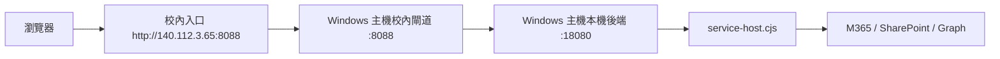

# 切帳號快速接手手冊

這份文件是給你在**切帳號、切工作階段、或重新接手專案**時直接照做的。

目標很單純：
- 不重學
- 不重猜
- 不重跑沒必要的步驟
- 先把系統拉回可工作狀態，再做功能或效能調整

---

## 先看這份文件的順序

1. 先確認你現在是在專案根目錄
2. 再確認啟動需要的環境變數與設定檔
3. 先拉起本機後端與校內入口
4. 再看 Cloudflare Pages 是否需要補發
5. 最後才跑驗證與煙燻測試

這個順序是目前驗證過最穩的。

---

## 目前已驗證的啟動路徑



固定入口：
- 校內入口：`http://140.112.3.65:8088/`
- 本機後端：`http://127.0.0.1:18080`
- Cloudflare Pages：`https://isms-campus-portal.pages.dev/`

---

## 切帳號後先做的事

### 1. 進專案根目錄

```powershell
cd C:\Users\User\Playground\ISMS-Form-Redesign
```

### 2. 先看狀態

```powershell
git status --short
```

你通常會看到：
- 只有一些未追蹤雜項
- 或者前一輪留下的正常變更

如果你看到明顯不是這次要動的檔案，先不要亂清，先確認它是不是前一輪留下的。

### 3. 先確認必要環境變數

這個專案要先有：
- `AUTH_SESSION_SECRET`

如果沒有設，後端通常會直接卡住。

### 4. 確認本機後端設定檔沒有 BOM

這個設定檔必須是 **UTF-8 無 BOM**：

```powershell
.runtime\runtime.local.host.json
```

如果這個檔案被 PowerShell 寫成有 BOM，`service-host.cjs` 會 JSON parse 失敗。

重新產生這個檔案時，請用無 BOM 寫法：

```powershell
[System.IO.File]::WriteAllText(
  $path,
  $json,
  [System.Text.UTF8Encoding]::new($false)
)
```

---

## 已驗證過的本機啟動流程

### 啟動後端

```powershell
$env:AUTH_SESSION_SECRET = '<stable-long-secret>'
node m365/campus-backend/service-host.cjs .runtime/runtime.local.host.json
```

成功時會看到類似：
- `service-host starting ...`
- `unit-contact-campus-backend listening on http://127.0.0.1:18080`

### 驗證後端健康

```powershell
Invoke-WebRequest http://127.0.0.1:18080/api/unit-contact/health
Invoke-WebRequest http://127.0.0.1:18080/api/auth/health
```

健康回應要看到：
- `ready: true`

### 啟動校內閘道

```powershell
powershell -NoProfile -ExecutionPolicy Bypass -File .\scripts\start-host-campus-gateway.ps1
```

這支腳本會：
- 停掉舊的閘道程序
- 拉起 `host-campus-gateway.cjs`
- 把日誌寫到 `.runtime`

### 驗證校內入口

```powershell
Invoke-WebRequest http://127.0.0.1:8088/api/unit-contact/health
```

如果 `18080` 正常，`8088` 應該可以順利代理過去。

---

## Cloudflare Pages 恢復流程

如果 Pages 入口 stale，或 backend origin 有變動，先用下面方式恢復：

```powershell
powershell -NoProfile -ExecutionPolicy Bypass -File .\scripts\ensure-cloudflare-pages-live.ps1 -OriginUrl http://127.0.0.1:18080
```

如果自動檢查判定 Pages 不健康，它會：
- 重新建立 quick tunnel
- 更新 Pages full-proxy 入口
- 讓正式站重新對齊目前 origin

---

## 驗證順序

切帳號後、改完程式後，驗證順序固定照這個跑：

```powershell
node scripts\campus-live-regression-smoke.cjs
node scripts\live-security-smoke.cjs
node scripts\cloudflare-pages-regression-smoke.cjs
node scripts\campus-browser-regression-smoke.cjs
```

如果這次有動到特定模組，再加跑：

```powershell
node scripts\unit-contact-admin-review-smoke.cjs
node scripts\unit-contact-account-to-fill-smoke.cjs
node scripts\unit-contact-public-visual-smoke.cjs
node scripts\campus-unit-contact-public-visual-smoke.cjs
node scripts\training-roster-focus-smoke.cjs
node scripts\audit-followup-smoke.cjs
node scripts\stress-regression.cjs
node scripts\role-flow-probe.cjs
```

---

## 目前最容易堵住的點

### 1. `AUTH_SESSION_SECRET` 沒設

症狀：
- 後端起不來
- 驗證失敗
- 某些 API 直接報錯

處理：
- 先把環境變數補上，再啟動 `service-host.cjs`

### 2. `.runtime/runtime.local.host.json` 有 BOM

症狀：
- `service-host.cjs` JSON parse error
- 看起來像是內容正確，但實際就是起不來

處理：
- 用無 BOM 寫法重寫檔案

### 3. `127.0.0.1:18080` 沒起來

症狀：
- `8088` 還活著，但 API health 失敗

處理：
- 重啟 `service-host.cjs`
- 確認本機後端真的在跑

### 4. `8088` 有開，但 API health 失敗

症狀：
- 校內入口能開
- 但 API 會 502 或 health 失敗

處理：
- 先看 `18080`
- 再看 host gateway

### 5. Cloudflare Pages 入口和目前 origin 不一致

症狀：
- Pages 頁面看起來舊
- smoke 報告和實際頁面不一致

處理：
- 再跑一次 `ensure-cloudflare-pages-live.ps1`

### 6. 煙燻測試互相搶 session

症狀：
- 同一批測試有時候會出現 `401`
- 重跑單支就正常

處理：
- 優先單支驗證
- 不要把所有測試硬塞在同一個 session 同時跑

### 7. 測試腳本的函式簽名過舊

症狀：
- 測試腳本顯示失敗
- 其實是字串檢查或函式名稱改了

處理：
- 先看是不是 smoke 腳本過舊，不要先懷疑產品

---

## 已驗證能直接用的部署流程

### 本機程式變更後

1. 修改程式
2. 跑 `node --check`
3. 跑對應煙燻測試
4. `git add` / `git commit`
5. `git push origin main`
6. 如果有 guest runtime，SSH 到 guest 拉版
7. 如需，重啟 `isms-unit-contact-backend.service`
8. 重跑 live smoke

### Guest 端已驗證的拉版命令

```bash
sudo -u ismsbackend git -C /srv/isms-form-redesign pull --ff-only origin main
sudo systemctl restart isms-unit-contact-backend.service
sudo systemctl is-active isms-unit-contact-backend.service
```

如果 `git pull` 遇到：
- `gnutls_handshake() failed`

先設：

```bash
git config --global http.version HTTP/1.1
```

再重試。

---

## 目前的已知穩定狀態

以下項目最近都已驗過：
- 登入到儀表板
- 教育訓練名單
- 內稽檢核表
- 單位申請與審核
- 附件預覽與下載
- 權限與安全標頭
- 效能熱路徑

---

## 這份文件的使用方式

你切帳號回來後，不用先問我「現在到哪一步」。

直接照這份文件做：

1. 看 `git status`
2. 設 `AUTH_SESSION_SECRET`
3. 起 `service-host.cjs`
4. 起 `8088` 閘道
5. 跑 Pages 恢復
6. 跑煙燻測試

如果有卡住，先對照上面的堵塞點，不要重跑整套流程。
