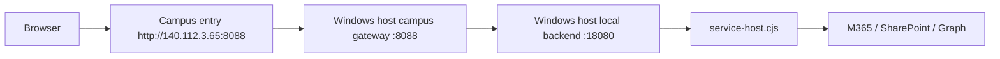

# Fast Redeploy Runbook

This document records the shortest known-good path to bring the current ISMS campus stack back up after a context switch.

## What this runbook covers

- Windows host campus gateway on `8088`
- local backend on `18080`
- Cloudflare Pages full-proxy recovery
- the exact checks that were green in the last successful run

If the repo is already healthy and you only need to resume work after switching accounts, start here.

## 1. Current known-good runtime path



Current live recovery path:

- campus entry: `http://140.112.3.65:8088/`
- host gateway: `host-campus-gateway.cjs`
- backend: `m365/campus-backend/service-host.cjs`
- runtime config: `.runtime/runtime.local.host.json`

## 2. Before starting

1. Stay in the repo root: `C:\Users\User\Playground\ISMS-Form-Redesign`
2. Keep a long-lived `AUTH_SESSION_SECRET` in the shell you are using.
3. Make sure `.runtime/runtime.local.host.json` is UTF-8 without BOM.
4. Do not spend time on named tunnel bootstrapping first. The known-good fast path currently uses `8088 -> 18080`.

### BOM pitfall

PowerShell file writes can quietly add a BOM. If `.runtime/runtime.local.host.json` gets a BOM, `service-host.cjs` will fail with a JSON parse error.

Use a BOM-free write when you regenerate that file:

```powershell
[System.IO.File]::WriteAllText(
  $path,
  $json,
  [System.Text.UTF8Encoding]::new($false)
)
```

## 3. Start the backend

This is the exact startup path that worked in the last successful session:

```powershell
$env:AUTH_SESSION_SECRET = '<stable-long-secret>'
node m365/campus-backend/service-host.cjs .runtime/runtime.local.host.json
```

Expected output:

- `service-host starting ...`
- `unit-contact-campus-backend listening on http://127.0.0.1:18080`

### Verify backend health

```powershell
Invoke-WebRequest http://127.0.0.1:18080/api/unit-contact/health
Invoke-WebRequest http://127.0.0.1:18080/api/auth/health
```

Healthy responses should report `ready: true`.

## 4. Start or restart the campus gateway

If `8088` is not already listening, restart the gateway:

```powershell
powershell -NoProfile -ExecutionPolicy Bypass -File .\scripts\start-host-campus-gateway.ps1
```

This script:

- stops the old gateway PID if one exists
- starts `host-campus-gateway.cjs`
- writes logs under `.runtime`

### Verify campus entry

```powershell
Invoke-WebRequest http://127.0.0.1:8088/api/unit-contact/health
```

If `18080` is healthy, `8088` should proxy through correctly.

## 5. Recover Cloudflare Pages

If the Pages side is stale or the proxy origin changed, recover it against the current `18080` origin:

```powershell
powershell -NoProfile -ExecutionPolicy Bypass -File .\scripts\ensure-cloudflare-pages-live.ps1 -OriginUrl http://127.0.0.1:18080
```

If the automatic check says Pages is unhealthy, it will bootstrap the quick tunnel and refresh the Pages full-proxy entry.

## 6. Run the smoke checks

Run these in this order:

```powershell
node scripts\campus-live-regression-smoke.cjs
node scripts\live-security-smoke.cjs
node scripts\cloudflare-pages-regression-smoke.cjs
node scripts\campus-browser-regression-smoke.cjs
```

For the feature-specific flows that were recently stabilized, also run:

```powershell
node scripts\unit-contact-admin-review-smoke.cjs
node scripts\unit-contact-account-to-fill-smoke.cjs
node scripts\unit-contact-public-visual-smoke.cjs
node scripts\campus-unit-contact-public-visual-smoke.cjs
node scripts\training-roster-focus-smoke.cjs
node scripts\audit-followup-smoke.cjs
```

## 7. Deployment order

When making code changes:

1. Commit locally.
2. Push to GitHub.
3. Start or refresh the local backend on `18080`.
4. Start or restart the campus gateway on `8088`.
5. Refresh Cloudflare Pages if the origin changed.
6. Re-run the smoke checks.

### Guest fallback path

If you need the older guest-based deployment path, use:

```bash
ssh -p 2222 admin@127.0.0.1
sudo -u ismsbackend git -C /srv/isms-form-redesign pull --ff-only origin main
sudo systemctl restart isms-unit-contact-backend.service
sudo systemctl is-active isms-unit-contact-backend.service
```

If `git pull` hits `gnutls_handshake() failed`, set:

```bash
git config --global http.version HTTP/1.1
```

and retry.

## 8. Common blockers and what they mean

- `AUTH_SESSION_SECRET is required`
  - The shell you launched from does not have the secret set.
- JSON parse error with a strange invisible character
  - `.runtime/runtime.local.host.json` was saved with BOM.
- `127.0.0.1:18080` is down
  - The backend process did not stay running.
- `8088` is up but API health fails
  - The gateway is alive, but the backend origin is not.
- Pages health fails while `18080` is healthy
  - Refresh Pages against the current origin using the bootstrap script.

## 9. Last known-good outcome

The following were green in the last successful run:

- `campus-live-regression-smoke`
- `live-security-smoke`
- `cloudflare-pages-regression-smoke`
- `campus-browser-regression-smoke`
- `unit-contact-admin-review-smoke`
- `unit-contact-account-to-fill-smoke`
- `unit-contact-public-visual-smoke`
- `campus-unit-contact-public-visual-smoke`
- `training-roster-focus-smoke`
- `audit-followup-smoke`