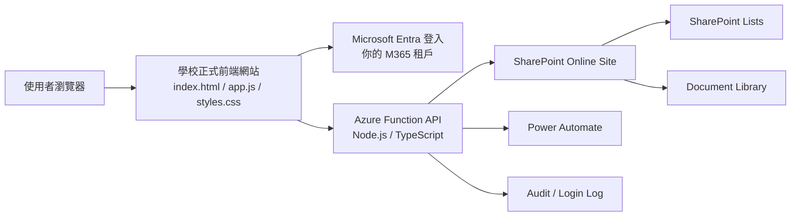
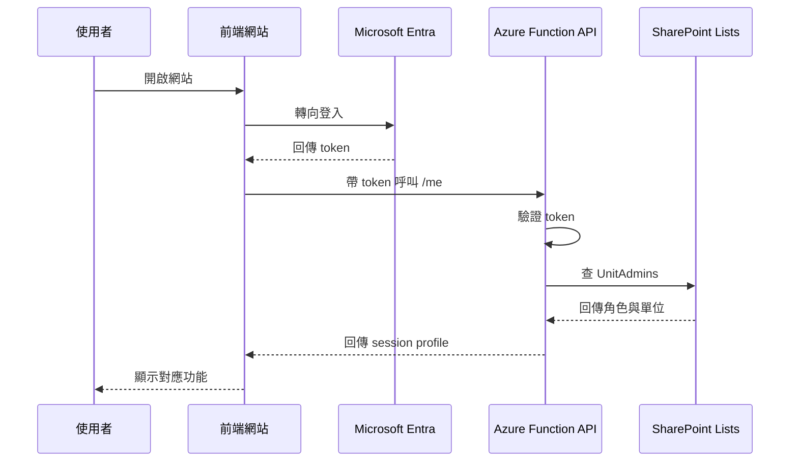
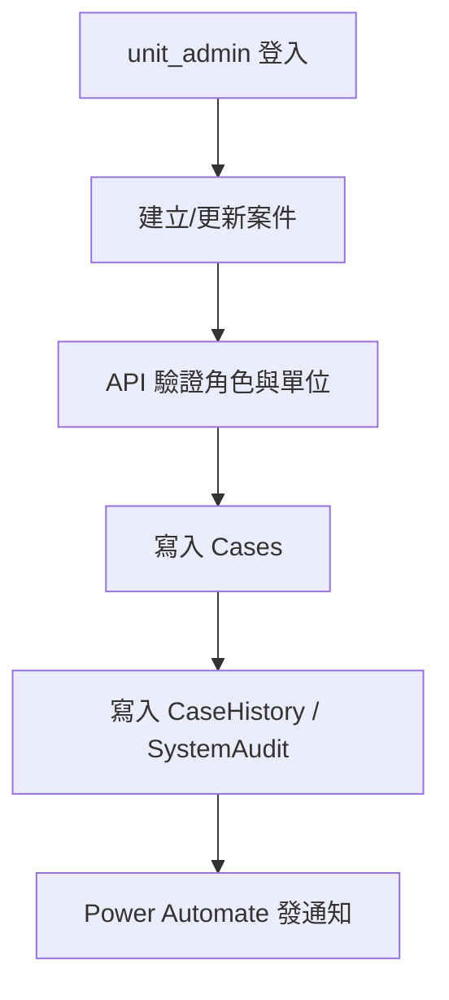

# M365 / SharePoint 架設方案

- 日期：2026-03-07
- 適用對象：前端放學校正式網站、無法使用學校 SSO、由最高管理者控管 100+ 單位管理員、整體使用規模約 300 人
- 結論：在你目前條件下，最佳方案不是自建帳號密碼，也不是讓前端直接讀寫 SharePoint List；最佳方案是 `學校前端靜態站 + 你的 Microsoft Entra 登入 + Azure Function API + SharePoint Lists / Document Library`

## 一句話結論

你要管的是「誰有權限」，不是「誰的密碼是什麼」。

因此建議：

1. 前端放學校正式網站
2. 使用你自己的 Microsoft Entra 租戶做登入
3. 使用 Guest 邀請或你可控的內部帳號管理單位管理員
4. 後端由 Azure Function 統一處理商業邏輯與權限判斷
5. 資料存 SharePoint Lists
6. 附件存 SharePoint Document Library
7. 通知與提醒交給 Power Automate

## 為什麼不是「自己開帳號密碼」

如果你自己管理帳號密碼，會直接多出以下責任：

1. 密碼重設
2. 密碼強度政策
3. MFA
4. 帳號停權與離任回收
5. 異常登入與稽核

這對 100 多位單位管理員來說不划算，也不穩。

## 推薦架構

## 為什麼這是最佳方案

### 1. 前端留在學校網站沒問題

這個專案目前本質上是前端單頁，正式版放在學校網站空間最合理：

1. 網址與對外形象正式
2. 前端檔案簡單，靜態部署容易
3. 可與資料層分離，不把後端綁死在同一台主機

### 2. 認證用你的 Entra，而不是學校 SSO

因為你明確說學校 SSO 不能用，所以改成：

1. 在你的 M365 / Entra 建一個 SPA 應用程式註冊
2. 使用者登入後拿到 Entra token
3. API 驗證 token 後，再查你的授權資料

這樣你還是掌握系統入口，但不需要自己保管密碼。

### 3. 後端不要直接讓前端打 SharePoint Lists

這是本案最重要的判斷。

如果前端直接用 Graph / SharePoint REST 讀 List，雖然能做，但有兩個問題：

1. 商業邏輯都暴露在前端
2. 單位級資料隔離會變弱，因為真正的資料安全會過度依賴前端過濾

所以最好的方式是：

1. 前端只打你自己的 API
2. API 用 app-only 權限存取 SharePoint
3. 權限與單位可見範圍全部由 API 控制

這是我根據 Microsoft Graph selected permissions 與 SharePoint 權限限制做的工程建議。

## 帳號模式建議

你有兩種可行方式：

### 方案 A：內部帳號

你在自己的 M365 tenant 建立單位管理員帳號。

適合：

1. 你能管理全部帳號生命週期
2. 你有足夠授權與維運能力

### 方案 B：Guest 邀請制

你把 100 多位單位管理員邀請成 Guest，用他們現有信箱登入。

適合：

1. 單位管理員原本就分散在不同組織或信箱體系
2. 你不想自己養一堆帳號密碼
3. 你只想控管 allowlist

### 本案建議

優先建議 `Guest 邀請制`。

理由：

1. 你只要維護 100 多位單位管理員名單
2. 不用幫每個人發密碼
3. 可保留 Microsoft Entra 的驗證能力

## 系統角色設計

先收斂成兩層即可：

1. `super_admin`
2. `unit_admin`

如果未來真的有需要，再加：

1. `unit_editor`
2. `review_only`
3. `auditor`

## 權限模型

### super_admin

1. 管理單位管理員名單
2. 查全部案件
3. 管理檢核表模板
4. 管理教育訓練名單
5. 查登入紀錄與系統稽核

### unit_admin

1. 僅能查自己單位資料
2. 可建立與更新自己單位案件
3. 可填報檢核表
4. 可填報教育訓練資料
5. 不可管理其他單位帳號

## 資料層設計

### 建議 Site

建立一個專用站台，例如：

- `ISMS-Forms`

這個 site 不建議開放一般使用者直接瀏覽 SharePoint UI。
人員只使用學校前端網站；真正的資料操作走 API。

### 建議 Lists

#### 1. `Units`

欄位：

1. `UnitCode`
2. `ParentUnitCode`
3. `UnitName`
4. `IsActive`
5. `SortOrder`

#### 2. `UnitAdmins`

欄位：

1. `Email`
2. `DisplayName`
3. `Role`
4. `UnitCode`
5. `Status`
6. `LastLoginAt`
7. `SourceType` (`member` / `guest`)

#### 3. `Cases`

欄位：

1. `CaseId`
2. `UnitCode`
3. `Status`
4. `Title`
5. `ProblemDesc`
6. `Occurrence`
7. `CorrectiveAction`
8. `RootCause`
9. `RootElimination`
10. `CorrectiveDueDate`
11. `CreatedByEmail`
12. `AssignedToEmail`
13. `CreatedAt`
14. `UpdatedAt`
15. `ClosedAt`

#### 4. `CaseHistory`

欄位：

1. `CaseId`
2. `ActionType`
3. `ActionBy`
4. `ActionAt`
5. `Remark`
6. `SnapshotJson`

#### 5. `ChecklistTemplates`

欄位：

1. `TemplateCode`
2. `Version`
3. `SectionName`
4. `QuestionCode`
5. `QuestionText`
6. `SortOrder`
7. `IsActive`

#### 6. `Checklists`

欄位：

1. `ChecklistId`
2. `UnitCode`
3. `Year`
4. `Status`
5. `FillerEmail`
6. `SupervisorName`
7. `SupervisorTitle`
8. `SummaryJson`
9. `AnswersJson`
10. `CreatedAt`
11. `UpdatedAt`

#### 7. `TrainingForms`

欄位：

1. `TrainingFormId`
2. `UnitCode`
3. `TrainingYear`
4. `Status`
5. `FillerEmail`
6. `SubmitterPhone`
7. `SubmitterEmail`
8. `FillDate`
9. `SummaryJson`
10. `CreatedAt`
11. `UpdatedAt`

#### 8. `TrainingRoster`

欄位：

1. `TrainingFormId`
2. `UnitCode`
3. `Name`
4. `UnitName`
5. `Identity`
6. `JobTitle`
7. `EmployeeStatus`
8. `CompletedGeneral`
9. `IsInfoStaff`
10. `CompletedProfessional`
11. `Note`

#### 9. `LoginAudit`

欄位：

1. `Email`
2. `DisplayName`
3. `Role`
4. `UnitCode`
5. `LoginAt`
6. `ClientIp`
7. `UserAgent`
8. `Result`

#### 10. `SystemAudit`

欄位：

1. `Module`
2. `EntityId`
3. `ActionType`
4. `ActorEmail`
5. `ActorRole`
6. `OccurredAt`
7. `BeforeJson`
8. `AfterJson`

### 建議 Document Libraries

#### 1. `CaseEvidence`

metadata：

1. `CaseId`
2. `UnitCode`
3. `UploadedBy`
4. `UploadedAt`

#### 2. `ChecklistEvidence`

metadata：

1. `ChecklistId`
2. `UnitCode`
3. `UploadedBy`
4. `UploadedAt`

#### 3. `TrainingEvidence`

metadata：

1. `TrainingFormId`
2. `UnitCode`
3. `UploadedBy`
4. `UploadedAt`

## API 設計

### 推薦

API 層建議用 Azure Function。

原因：

1. 夠輕
2. 不需要你養完整 VM
3. 可集中做權限與資料驗證
4. 可把 SharePoint 的 app-only 權限留在後端，不暴露給瀏覽器

### API 責任

1. 驗證 Entra token
2. 讀 `UnitAdmins` 做授權
3. 依 `UnitCode` 做資料過濾
4. 寫入 `SystemAudit`
5. 處理附件 metadata
6. 統一錯誤訊息與 business rule

### 典型 API

1. `POST /auth/exchange`
2. `GET /me`
3. `GET /cases`
4. `POST /cases`
5. `PATCH /cases/{id}`
6. `POST /cases/{id}/respond`
7. `POST /cases/{id}/tracking`
8. `GET /checklists`
9. `POST /checklists`
10. `GET /training/forms`
11. `POST /training/forms`
12. `POST /attachments/upload-url` 或直接上傳代理

## 為什麼不用「前端直連 SharePoint」

如果前端直連 SharePoint，會有以下風險：

1. 使用者若有 List 權限，理論上可能看到超出 UI 顯示範圍的資料
2. 商業規則只能靠前端限制
3. 稽核與防呆會分散在前端

因此最佳方案不是：

- `前端 + MSAL + 直接打 SharePoint`

而是：

- `前端 + MSAL + API + SharePoint`

## 如果你現在沒有 Azure 資源

這時可以有一個備援版：

1. 前端放學校網站
2. 用 Entra 做登入
3. 前端直接打 Microsoft Graph / SharePoint REST
4. 後端資料仍放 SharePoint Lists / Document Library

但這只是 `可上線版`，不是我建議的最終版。

原因：

1. 前端會拿到較廣的 delegated 權限
2. row-level access control 幾乎只能靠前端與 SharePoint 權限設計
3. 商業邏輯分散在瀏覽器
4. 日後稽核、維護、API 重用都比較差

所以我會把它定義成：

- `V1 備援方案`

而不是：

- `正式長期方案`

## SharePoint 設計注意事項

Microsoft 官方限制需要先避開：

1. `List View Threshold` 預設約 `5,000`
2. unique permissions 支援到 `50,000`，但一般建議控制在 `5,000`

所以不要做：

1. 每筆案件獨立權限
2. 每筆清單項目都打破繼承

要做的是：

1. 用 API 做 row-level access control
2. Lists 針對常用查詢欄位建立索引
3. 所有列表查詢都分頁

### 建議索引欄位

#### `Cases`

1. `CaseId`
2. `UnitCode`
3. `Status`
4. `CreatedAt`
5. `UpdatedAt`
6. `AssignedToEmail`

#### `Checklists`

1. `ChecklistId`
2. `UnitCode`
3. `Year`
4. `Status`
5. `UpdatedAt`

#### `TrainingForms`

1. `TrainingFormId`
2. `UnitCode`
3. `TrainingYear`
4. `Status`
5. `UpdatedAt`

## 前端登入流程

## 開單與填報流程

## Guest 管理建議

如果你走 Guest 邀請制，建議這樣做：

1. Entra 先邀請成 Guest
2. `UnitAdmins` list 再建立授權資料
3. 若人員離任：
   - 停用或移除 Guest
   - 同步把 `UnitAdmins.Status` 設成停用

不要只刪 SharePoint 權限，因為真正入口是 Entra + API。

## SharePoint / Entra 設定建議

### Entra

1. 建立 SPA app registration
2. 建立 API app registration
3. 使用最小權限原則
4. 優先考慮 `Sites.Selected` / `Lists.SelectedOperations.Selected`

### SharePoint

1. 建立專用 site
2. 資料站台不給一般使用者直接操作 UI
3. site sharing 設定保守
4. 若採 guest，預先建立 guest，再限制 site 層級分享

### Power Automate

只用在：

1. 到期提醒
2. 新單通知
3. 退回通知
4. 每週摘要

不要把核心商業邏輯全部放在 Flow 裡，避免難維護。

## 風險與對策

### 風險 1：前端直連 SharePoint 權限過寬

對策：

1. 改成 API 層統一控管

### 風險 2：List 超過 5,000 threshold

對策：

1. 建索引
2. 分頁
3. 用 API 做條件查詢

### 風險 3：單位管理員帳號生命週期失控

對策：

1. `UnitAdmins` 與 Entra guest/member 同步管理
2. 建停用流程

### 風險 4：附件散亂

對策：

1. 固定放 Document Library
2. 以 metadata 關聯案件編號與單位

## 建議上線順序

### Phase 1：基礎建置

1. Entra app registration
2. SharePoint site
3. Lists / libraries
4. API skeleton

### Phase 2：帳號與授權

1. 建 `Units`
2. 建 `UnitAdmins`
3. 匯入 100+ 單位管理員

### Phase 3：核心模組

1. Cases
2. Checklists
3. TrainingForms
4. Attachments

### Phase 4：稽核與通知

1. LoginAudit
2. SystemAudit
3. Power Automate reminders

### Phase 5：試營運

1. 先 10 個單位
2. 再擴大到全部單位

## 最後建議

在你目前限制下，我的最終建議是：

1. 不要自建帳密
2. 用你自己的 Microsoft Entra 做認證
3. 用 `Guest 邀請制 + UnitAdmins allowlist` 做授權
4. 前端只打 API，不直接打 SharePoint
5. SharePoint 當資料與附件後端

如果你要正式做下一步，應該接著產出：

1. `SharePoint Lists 欄位明細`
2. `API 規格`
3. `Entra app registration 設定清單`
4. `前端登入整合實作計畫`

## 參考來源

以下資訊均來自官方文件；架構選型與資料設計為基於這些限制的工程推論：

1. Microsoft 365 Education A3 includes SharePoint Online:
   - https://learn.microsoft.com/en-us/office365/servicedescriptions/office-365-platform-service-description/microsoft-365-education
2. Microsoft Entra External ID / B2B guest:
   - https://learn.microsoft.com/en-us/azure/active-directory/external-identities/external-identities-overview
   - https://learn.microsoft.com/en-us/azure/active-directory/external-identities/what-is-b2b
3. MSAL Browser for SPA:
   - https://learn.microsoft.com/en-us/entra/msal/javascript/browser/about-msal-browser
4. SharePoint large list thresholds:
   - https://support.microsoft.com/en-us/office/manage-large-lists-and-libraries-b8588dae-9387-48c2-9248-c24122f07c59
5. SharePoint / OneDrive sharing controls:
   - https://learn.microsoft.com/en-us/sharepoint/change-external-sharing-site
   - https://learn.microsoft.com/en-us/sharepoint/turn-external-sharing-on-or-off
   - https://learn.microsoft.com/en-us/sharepoint/collaboration-options
6. Microsoft Graph selected permissions:
   - https://learn.microsoft.com/en-us/graph/permissions-selected-overview
7. Power Automate seeded capabilities in Microsoft 365 Education:
   - https://learn.microsoft.com/en-us/microsoft-365/education/guide/0-start/all-license
   - https://learn.microsoft.com/en-us/power-platform/admin/power-automate-licensing/types
