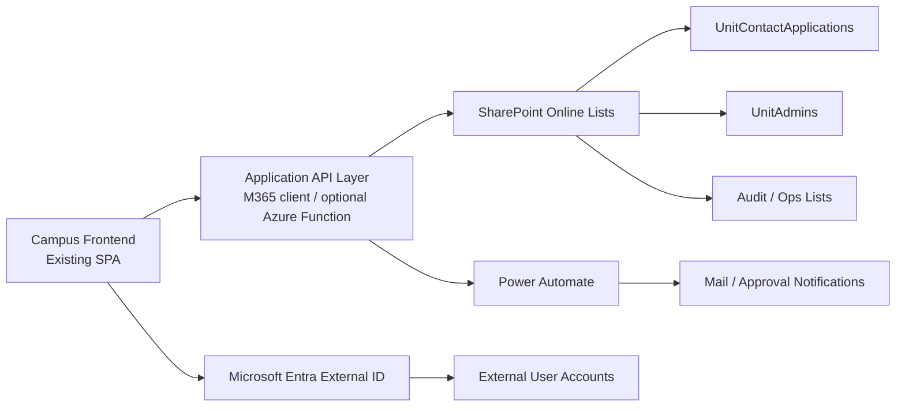

# M365 Unit Contact Implementation Blueprint

- Updated: 2026-03-11
- Scope: add a "申請單位資安窗口" flow to the existing frontend, keep the frontend hosted on campus, and move identity/workflow/data persistence to M365-backed services.

> Current recommendation:
> launch the A3-ready version first with SharePoint + Power Automate.
> See [docs/m365-a3-unit-contact-blueprint.md](/C:/Users/MOECISH/Desktop/ai-isms/ISMS-Form-Redesign/docs/m365-a3-unit-contact-blueprint.md).
> This document remains the future-state blueprint for a later Azure / Entra upgrade.

## Executive Summary

This project can move to a practical hybrid architecture.

For the first production cut under Microsoft 365 A3, use the lighter A3 path.
For later upgrades, use the target architecture below.

1. Keep the current frontend as the campus-facing SPA.
2. Add a new public/internal entry on the homepage for `申請單位資安窗口`.
3. Move account lifecycle, approval workflow, and master records to Microsoft 365:
   - Microsoft Entra External ID for sign-in
   - SharePoint Online Lists for workflow data
   - Power Automate for approval and notification
   - Optional Azure Function for Graph-heavy or signed-link logic

This design still works even when:

- contacts do not use a school email address
- the system does not integrate with campus SSO
- the frontend stays in the existing codebase

## Key Decisions

### 1. Frontend on campus, backend on M365

Yes. This is a good split.

- Campus-hosted frontend controls your UI and lets you continue evolving this project.
- M365 gives you durable identity, approval workflow, mail delivery, audit trail, and storage.
- It avoids keeping passwords and account state only in browser storage.

### 2. Should frontend be designed first?

Yes, but in the right order.

Recommended order:

1. Freeze the identity and approval model first.
2. Design the user flow and page states.
3. Then implement the frontend.

Do not start with high-fidelity visuals only. Start with:

- entry point
- form fields
- validation rules
- approval states
- activation states
- error states

### 3. Recommended account model

Use `application + approval + activation`, not `application + plaintext password email`.

Recommended V1:

1. Applicant fills the form in your system.
2. Backend stores the request in SharePoint.
3. Admin reviews and approves.
4. System sends an activation link.
5. User finishes account creation in Entra External ID and chooses their own password.

This is better than emailing a generated password.

## Recommended Target Architecture

## Why This Fits Your Constraints

### Non-school email is allowed

Do not restrict the application to school-domain email only.

Instead:

- allow external email
- require email ownership verification
- require admin approval before the account becomes active

### No campus SSO

That is fine.

Use Entra External ID as the system identity provider for unit contacts. The app does not need campus SSO to work.

### M365 as the backend

Yes, M365 can cover most of the backend requirements if you split responsibilities clearly:

- identity: Entra External ID
- data/workflow: SharePoint Lists
- approval/notification: Power Automate
- advanced logic: optional Azure Function

## Recommended V1 Flow

### Entry

Add a button on the homepage:

- `申請單位資安窗口`

### Application form

Fields:

1. `單位類別`
2. `一級單位`
3. `二級單位` when applicable
4. `姓名`
5. `分機`
6. `信箱`
7. `備註 / 申請原因` optional

Frontend should reuse the current unit selector logic from:

- [unit-module.js](/C:/Users/MOECISH/Desktop/ai-isms/ISMS-Form-Redesign/unit-module.js)
- [units-data.json](/C:/Users/MOECISH/Desktop/ai-isms/ISMS-Form-Redesign/units-data.json)

### Submit

On submit:

1. Create a `UnitContactApplications` item in SharePoint.
2. Status becomes `pending_email_verification` or `pending_review`.
3. Send confirmation email.

### Review

Admin reviews:

- whether the unit already has a primary contact
- whether the email is already bound to another unit
- whether the applicant should be primary or backup contact

Decision:

- approve
- reject
- return for correction

### Activation

Recommended activation path:

1. Approval mail sends an activation URL.
2. User goes to Entra External ID sign-up/sign-in flow.
3. User verifies email and chooses their own password.
4. On first successful sign-in, the app checks whether an approved application exists for that email.
5. If found, the app provisions the app-side role and bound unit profile.

### First login

If the user self-creates the password during activation, you do not need a forced password change.

If your organization insists on admin-created accounts, use:

- generated temporary password
- `forceChangePasswordNextSignIn`

But this should be the fallback path, not the preferred path.

## Two Viable Activation Patterns

### Pattern A: Recommended

`Approve -> activation link -> self-service sign-up -> user sets own password`

Pros:

- no plaintext password email
- email ownership verified by Entra
- better long-term security

Cons:

- slightly more moving parts

### Pattern B: Fallback

`Approve -> create account by Graph -> send temporary password -> force change on first sign-in`

Pros:

- closer to your original mental model
- easier to explain operationally

Cons:

- weaker security
- more support burden when users lose the temporary password

## M365 Components

### Entra External ID

Use for:

- unit contact authentication
- email/password or email-based sign-up
- optional username alias if you later want a non-email sign-in ID

Recommended custom attributes:

- `unitCode`
- `unitName`
- `contactType` (`primary` / `backup`)
- `extensionNumber`
- `approvalId`

### SharePoint Online Lists

Recommended site:

- `ISMS-Forms`

Recommended lists for the new feature:

#### `UnitContactApplications`

Suggested columns:

1. `ApplicationId`
2. `ApplicantName`
3. `ApplicantEmail`
4. `ExtensionNumber`
5. `UnitCategory`
6. `PrimaryUnitCode`
7. `PrimaryUnitName`
8. `SecondaryUnitCode`
9. `SecondaryUnitName`
10. `ContactType`
11. `Status`
12. `SubmittedAt`
13. `ReviewedAt`
14. `ReviewedBy`
15. `ReviewComment`
16. `ActivationSentAt`
17. `ActivatedAt`
18. `ExternalUserId`

#### `UnitAdmins`

Suggested columns:

1. `ExternalUserId`
2. `DisplayName`
3. `Email`
4. `ExtensionNumber`
5. `UnitCode`
6. `UnitName`
7. `ContactType`
8. `Status`
9. `LastLoginAt`
10. `ActivatedAt`

#### `OpsAudit`

Suggested columns:

1. `EventType`
2. `ActorEmail`
3. `TargetEmail`
4. `UnitCode`
5. `RecordId`
6. `OccurredAt`
7. `PayloadJson`

### Power Automate

Use for:

- application submitted notifications
- approval workflow
- approval/rejection email
- activation email
- reminder email for unactivated approved users

### Optional Azure Function

Use only when needed for:

- signed activation link generation/validation
- Graph API user bootstrap
- server-side validation rules that are awkward in Power Automate
- support APIs consumed by the frontend

If your M365 admins are comfortable with Power Automate and the flow stays simple, V1 can be mostly M365-native.

## Frontend Changes In This Repo

### New routes

Recommended new routes:

- `#apply-unit-contact`
- `#apply-unit-contact-success`
- `#apply-unit-contact-status`
- `#activate-unit-contact`

### New module

Recommended new file:

- `unit-contact-application-module.js`

This module should own:

- application form rendering
- client-side validation
- submit state
- application status lookup view
- activation handoff view

### Existing modules to reuse

- [shell-module.js](/C:/Users/MOECISH/Desktop/ai-isms/ISMS-Form-Redesign/shell-module.js)
  - add homepage CTA
- [unit-module.js](/C:/Users/MOECISH/Desktop/ai-isms/ISMS-Form-Redesign/unit-module.js)
  - reuse unit cascade and autocomplete
- [ui-module.js](/C:/Users/MOECISH/Desktop/ai-isms/ISMS-Form-Redesign/ui-module.js)
  - reuse form helper UI and shared feedback
- [policy-module.js](/C:/Users/MOECISH/Desktop/ai-isms/ISMS-Form-Redesign/policy-module.js)
  - add role policy for `unit_contact_pending` and active contact states

### New integration layer

Recommended new files:

- `m365-api-client.js`
- `m365-auth-client.js`

These should gradually replace the current pure-local login/data flows for the new contact feature first, without forcing an immediate rewrite of the whole system.

## Recommended Build Phases

### Phase 0: Decisions

Freeze:

1. one unit can have how many contacts
2. whether backup contacts are allowed
3. activation pattern A or B
4. whether the applicant must be approved before account creation

Recommended defaults:

- `1 primary + 1 backup`
- admin approval required
- Pattern A preferred

### Phase 1: UX and screen spec

Produce:

1. homepage CTA placement
2. application form
3. submit success state
4. pending review state
5. rejection / correction state
6. activation state
7. first login profile confirmation state

### Phase 2: M365 foundation

Set up:

1. Entra External ID tenant/app registration
2. SharePoint site and lists
3. Power Automate flows
4. app permissions and least-privilege review

### Phase 3: Frontend integration

Implement in this repo:

1. new module and routes
2. M365 API client
3. application submission
4. status lookup
5. activation handoff

### Phase 4: Auth integration

Implement:

1. Entra sign-in for approved contacts
2. app-side user bootstrap from approved application
3. role binding to unit
4. first-login completion flow

### Phase 5: Operational hardening

Add:

1. retry-safe approval flows
2. duplicate prevention
3. audit dashboard
4. support export
5. expiry rules for stale pending applications

## Security Rules

1. Do not trust the unit submitted by the frontend alone; revalidate against official unit data.
2. Do not allow direct activation without an approved application record.
3. Do not allow the same active email to bind to multiple unrelated units without admin approval.
4. Do not send plaintext passwords unless Pattern B is explicitly approved.
5. Keep approval and activation events in an audit list.
6. Restrict M365 app permissions to the specific site/list scope when possible.

## Recommended Implementation Sequence For This Project

This is the order I recommend we build in this repo:

1. Add the new frontend route and page shell.
2. Add a clean form spec and validation.
3. Add an M365 API abstraction layer.
4. Wire form submission to SharePoint/Flow.
5. Add admin review screen or admin email review path.
6. Add Entra activation and first-login binding.
7. Migrate the rest of the system from local auth later if desired.

## My Recommendation

For your case, the best practical V1 is:

- frontend stays in this project
- new `申請單位資安窗口` button on homepage
- application data goes to SharePoint
- approval runs in Power Automate
- identity runs in Entra External ID
- approved user activates account and sets their own password

That gives you a realistic path to support 100+ unit contacts without turning this project into a giant rewrite all at once.

## Official Reference Links

- [Identity providers for external tenants](https://learn.microsoft.com/en-us/entra/external-id/customers/concept-authentication-methods-customers)
- [Collect custom user attributes during external tenant sign-up](https://learn.microsoft.com/en-us/entra/external-id/customers/how-to-define-custom-attributes)
- [Add and manage customer accounts](https://learn.microsoft.com/en-us/entra/external-id/customers/how-to-manage-customer-accounts)
- [Sign in with alias](https://learn.microsoft.com/en-us/entra/external-id/customers/how-to-sign-in-alias)
- [Quickstart for External ID](https://learn.microsoft.com/en-us/entra/external-id/customers/quickstart-get-started-guide)
- [MSAL Browser for JavaScript SPAs](https://learn.microsoft.com/en-us/entra/msal/javascript/browser/migrate-spa-implicit-to-auth-code)
- [Power Automate approvals overview](https://learn.microsoft.com/en-us/power-automate/get-started-approvals)
- [Wait for approval in a cloud flow](https://learn.microsoft.com/en-us/power-automate/wait-for-approvals)
- [Trigger approvals from Microsoft Lists / SharePoint lists](https://learn.microsoft.com/en-us/power-automate/trigger-sharepoint-list)
- [Overview of Selected permissions in OneDrive and SharePoint](https://learn.microsoft.com/en-us/graph/permissions-selected-overview)
