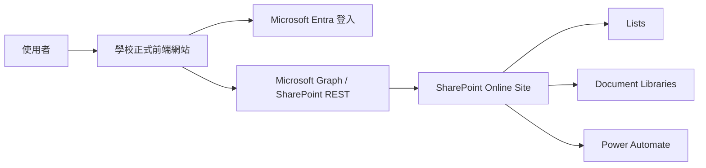

# M365 V1 直連 Graph / SharePoint 上線方案

- 日期：2026-03-07
- 適用情境：前端放學校正式網站、無法使用學校 SSO、目前優先省錢快速上線、先做 300 人內測
- 方案定位：`可上線的 V1 試營運方案`，不是最終長期架構

## 一句話結論

這個方案可以做，而且適合你現在先測試流程。

但你要接受一個前提：

- 這是 `先上線驗證流程` 的方案，不是 `最終治理最強` 的方案

正式版長期仍建議升級成：

- `前端 + Entra + API + SharePoint`

## V1 架構

## 為什麼這版適合你現在先做

1. 不用先建 Azure Function
2. 不用先租 API 主機
3. 可以直接把你目前前端專案接到 Entra + Graph
4. 你可以先驗證 100+ 單位管理員實際操作流程
5. 成本比正式 API 架構低很多

## 這版的硬限制

你要先清楚，這版不是沒有代價。

### 1. 權限控管沒有 API 版乾淨

因為資料讀寫直接從瀏覽器打到 Graph / SharePoint，所以：

1. 商業規則主要還是在前端
2. 資料隔離主要仰賴 SharePoint 權限與前端過濾
3. 稽核一致性沒有 API 版好

### 2. 前端一定要做最小權限設計

Microsoft Graph 官方建議應採最小權限原則。
如果你直接給過大的 delegated permission，後面會很難收。

來源：
- [Microsoft Graph permissions best practices](https://learn.microsoft.com/en-us/graph/best-practices-graph-permission)

### 3. 不適合做太複雜的跨清單商業邏輯

如果你未來要做：

1. 很複雜的核准邏輯
2. 很細的列級權限
3. 大量稽核規則
4. 跨模組交易一致性

那就該升級到 API 架構。

## 我建議你怎麼落地

### 1. 帳號模式

先用：

- `Guest 邀請制 + UnitAdmins allowlist`

理由：

1. 你只需要管 100 多位單位管理員名單
2. 不用自己發密碼
3. 可直接用 Entra 管登入

Microsoft 官方對外部來賓 / B2B 說明：
- [Microsoft Entra External ID overview](https://learn.microsoft.com/en-us/entra/external-id/external-identities-overview)
- [B2B collaboration FAQ](https://learn.microsoft.com/en-us/entra/external-id/faq)

### 2. SharePoint 站台模型

建議只建一個專用站台：

- `ISMS-Forms`

站台下放：

1. `Units`
2. `UnitAdmins`
3. `Cases`
4. `CaseHistory`
5. `Checklists`
6. `TrainingForms`
7. `TrainingRoster`
8. `LoginAudit`
9. `SystemAudit`
10. `CaseEvidence`
11. `ChecklistEvidence`
12. `TrainingEvidence`

### 3. 站台權限原則

V1 版不要做每筆案件獨立權限。

要做的是：

1. `super_admin` 為站台 owner
2. `unit_admin` 為站台 member 或指定群組成員
3. 真正畫面顯示資料，以 `UnitCode` 過濾
4. 不給使用者直接從 SharePoint UI 操作資料

原因：

- Microsoft 官方提醒 unique permissions 與大清單門檻要小心設計

來源：
- [Overview of Selected permissions in OneDrive and SharePoint](https://learn.microsoft.com/en-us/graph/permissions-selected-overview)
- [Manage large lists and libraries](https://support.microsoft.com/en-us/office/manage-large-lists-and-libraries-b8588dae-9387-48c2-9248-c24122f07c59)

## Entra App Registration 設計

### 1. 註冊一個 SPA 應用程式

用途：

- 讓前端直接登入並拿 token

Microsoft 官方 SPA / MSAL 說明：
- [Using MSAL Browser in your JavaScript applications](https://learn.microsoft.com/en-us/entra/msal/javascript/browser/about-msal-browser)

### 2. Redirect URI

至少先設兩個：

1. 正式站網址
2. 本機測試網址，例如 `http://127.0.0.1:8080`

### 3. 建議 delegated permissions

先用這組最務實：

1. `openid`
2. `profile`
3. `email`
4. `User.Read`
5. `Sites.Read.All`
6. `Sites.ReadWrite.All`

如果你要直接上傳附件到文件庫，再視情況加：

1. `Files.ReadWrite`
2. 或 `Files.ReadWrite.All`

這裡要注意：

1. `Sites.ReadWrite.All` 對 V1 很實用，但範圍偏大
2. 若你後面要縮權限，可以改走 `Lists.SelectedOperations.Selected` / `Sites.Selected`

Microsoft 官方文件指出：

- `list items` 讀取 least privileged delegated permission 是 `Sites.Read.All`
- 寫入 least privileged delegated permission 是 `Sites.ReadWrite.All`

來源：
- [List items API](https://learn.microsoft.com/en-us/graph/api/listitem-list?view=graph-rest-1.0)
- [Create a new entry in a SharePoint list](https://learn.microsoft.com/en-us/graph/api/listitem-create?view=graph-rest-1.0)
- [Overview of Selected permissions in OneDrive and SharePoint](https://learn.microsoft.com/en-us/graph/permissions-selected-overview)

## 前端整合方式

### 1. 登入

前端使用 `@azure/msal-browser`：

1. 使用 `Authorization Code Flow with PKCE`
2. 登入後取得 access token
3. 用 token 呼叫 Graph

這是 Microsoft 官方建議的 SPA 用法。

### 2. 取得登入者資料

先打：

- `GET /me`

拿到：

1. email
2. display name
3. tenant 資訊

### 3. 查 `UnitAdmins`

登入後第一步不是直接進主畫面，而是：

1. 用 email 去查 `UnitAdmins`
2. 查不到就拒絕進入
3. 查到才建立前端 session profile

建議前端 session 至少包含：

1. `email`
2. `displayName`
3. `role`
4. `unitCode`
5. `sourceType`

### 4. 每個列表只查自己需要的欄位

Graph 查 List item 時應配合：

1. `$expand=fields(...)`
2. `$filter`
3. 分頁

Microsoft 官方說明：

- 查大清單時要分頁
- 過濾在 indexed field 上效果最好

來源：
- [List items API](https://learn.microsoft.com/en-us/graph/api/listitem-list?view=graph-rest-1.0)

## 建議的前端模組對應

### 1. 案件列表

- 讀 `Cases`
- 以 `UnitCode eq '<目前單位>'` 過濾

### 2. 案件歷程

- 讀 `CaseHistory`
- 以 `CaseId` 過濾

### 3. 檢核表

- 讀寫 `Checklists`

### 4. 教育訓練

- 讀寫 `TrainingForms`
- 明細讀寫 `TrainingRoster`

### 5. 附件

- 上傳到對應 document library
- 檔名避免中文空白與特殊字元
- metadata 一定要有 `UnitCode` 與主鍵 ID

## V1 版你要守住的三條規矩

### 1. 不讓一般使用者直接逛 SharePoint 站台

因為你希望入口只有前端系統，不是 SharePoint UI。

### 2. 所有查詢都要加條件

不要先抓全表再用前端 filter。

正確做法是：

1. Graph query 就先加 `$filter`
2. 只取必要欄位
3. 分頁拿資料

### 3. 所有重要操作都寫入 Audit List

即使 V1 沒有 API，也要至少補：

1. `LoginAudit`
2. `SystemAudit`

否則之後你很難追誰做了什麼。

## V1 最適合的流程範圍

建議只先上這些：

1. 單位管理員登入
2. 開單 / 編修 / 回填
3. 檢核表填報
4. 教育訓練填報
5. 附件上傳
6. 管理者查詢與匯出

先不要急著做：

1. 複雜多層審批
2. 細粒度資料遮罩
3. 很多即時通知規則
4. 太多跨表即時計算

## 我對這個 V1 的風險判斷

### 可接受的風險

1. 300 人規模可運作
2. 作為試營運或校內第一版合理
3. 成本低、上線快

### 不可忽略的風險

1. delegated permission 範圍偏大
2. 商業規則仍偏前端
3. 若人員直接進 SharePoint UI，可能看到不該操作的入口
4. 稽核與資料隔離不如 API 版

## 我建議的執行順序

### Phase 1：一週內可完成的事

1. 建 `ISMS-Forms` 站台
2. 建 lists / libraries
3. 建 SPA app registration
4. 開 Entra guest 邀請
5. 匯入 `Units` 與 `UnitAdmins`

### Phase 2：把現有前端接上登入與資料

1. 接 `@azure/msal-browser`
2. 做 `getCurrentProfile()`
3. 把 `localStorage` 模擬資料切成 Graph 呼叫

### Phase 3：試營運

1. 先 5 到 10 個單位
2. 確認登入、查詢、開單、填報、附件
3. 再擴到 100+ 單位管理員

### Phase 4：升級判斷

只要出現以下任一條件，就該升級到 API 架構：

1. 權限控管開始變複雜
2. 稽核要求提高
3. 需要更多跨表商業規則
4. 需要更嚴格的資料隔離

## 我的最終建議

你現在先走這版是對的，但要把它當成：

- `先驗證流程的 V1`

不要把它當成：

- `永遠不升級的最終版`

對你目前來說，最務實的下一步就是：

1. 先把 Entra 登入接起來
2. 先把 `UnitAdmins` 與 `Cases / Checklists / TrainingForms` 接到 Graph
3. 先跑 5 到 10 個單位試營運

如果你要接著做，我下一步最適合直接幫你出的是：

1. `Entra app registration 設定清單`
2. `SharePoint Lists 欄位明細表`
3. `目前這個前端專案改接 Graph 的實作拆解`
