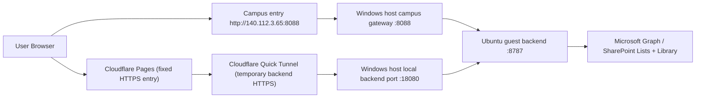

# Project Execution Flow

This document records the current production runtime flow for the ISMS project as it exists today.

## 1. Runtime Topology



Notes:
- The public HTTPS frontend is `https://isms-campus-portal.pages.dev/`.
- The current public backend exposure still depends on a Quick Tunnel. This is serviceable for UAT, but not the final infrastructure state.
- The campus entry remains `http://140.112.3.65:8088/` and is restricted by the Windows host gateway.

## 2. Frontend Boot Flow

1. `index.html` loads the SPA bundles.
2. `m365-config.js` loads base profile settings.
3. `m365-config.override.js` selects the live profile and endpoints.
4. `app.js` initializes modules, waits for auth/session state, and performs remote bootstrap.
5. `shell-module.js` gates route rendering until authenticated remote bootstrap is complete.

### Key frontend modules

- `app.js`
  - orchestration
  - repository switching
  - remote bootstrap
  - route wiring
- `shell-module.js`
  - login shell
  - responsive navigation
  - bootstrap gating
- `auth-module.js`
  - login
  - logout
  - request reset / redeem reset / change password
- `case-module.js`
  - corrective action workflow
- `checklist-module.js`
  - internal audit checklist workflow
- `training-module.js`
  - training statistics workflow
- `unit-contact-application-module.js`
  - public account application / status / success / activation instructions
- `admin-module.js`
  - account management
  - unit-contact admin review
  - audit trail
  - schema health
- `attachment-module.js`
  - remote attachment rendering and upload support

## 3. Data Source Strategy

The production system of record is M365 / SharePoint. The frontend talks to backend APIs; it does not write directly to SharePoint.

### Production mode

- live frontend uses `strictRemoteData: true`
- core modules run in backend mode (`m365-api`)
- `app-only` token mode is now active for live backend auth and Graph mail

### Technical debt still present

- local emulator and local fallback code paths still exist in `app.js`
- these paths are dormant in live, but remain maintenance risk if an override is missing or stale

## 4. Backend Routes

### Guest backend entry

- `m365/campus-backend/server.cjs`

### Current route groups

- `/api/unit-contact/health`
- `/api/unit-contact/apply`
- `/api/unit-contact/status`
- `/api/unit-contact/applications`
- `/api/unit-contact/review`
- `/api/unit-contact/activate`
- `/api/corrective-actions/*`
- `/api/checklists/*`
- `/api/training/*`
- `/api/system-users/*`
- `/api/auth/*`
- `/api/audit-trail/*`
- `/api/review-scopes/*`
- `/api/attachments/*`

## 5. SharePoint Data Layout

### Lists

- `UnitContactApplications`
- `UnitAdmins`
- `OpsAudit`
- `CorrectiveActions`
- `Checklists`
- `TrainingForms`
- `TrainingRosters`
- `SystemUsers`
- `UnitReviewScopes`

### Library

- `ISMSAttachments`
  - `corrective-actions`
  - `checklists`
  - `training`
  - `misc`

## 6. Guest Deployment Flow

### Repo and runtime paths

- repo: `/srv/isms-form-redesign`
- runtime: `/srv/isms-form-redesign/m365/campus-backend/runtime.local.json`
- frontend override: `/srv/isms-form-redesign/m365-config.override.js`
- service: `isms-unit-contact-backend.service`

### Standard deployment steps

1. Commit local changes.
2. Push to GitHub.
3. SSH to guest.
4. Pull repo under `ismsbackend`.
5. Update runtime/override if needed.
6. Restart `isms-unit-contact-backend.service` if backend/runtime changed.
7. Re-run campus live smoke.

### Known guest issue

If guest Git fails with `gnutls_handshake() failed`, set:

```bash
git config --global http.version HTTP/1.1
```

and retry the pull.

## 7. Campus Entry Flow

### Windows host gateway

- Windows host exposes `8088`
- campus IP restriction is enforced in `host-campus-gateway.cjs`
- current campus entry:
  - `http://140.112.3.65:8088/`

### Cloudflare entry

- Cloudflare Pages provides the fixed public frontend URL
- Quick Tunnel currently proxies backend API traffic for Pages `full-proxy` mode
- recovery depends on:
  - `scripts/bootstrap-cloudflare-pages-live.ps1`
  - `scripts/refresh-cloudflare-quick-pages-entry.ps1`
  - `scripts/ensure-cloudflare-pages-live.ps1`

## 8. Provisioning Flow

### Preferred

Run backend provision scripts first for SharePoint lists/libraries.

### Browser-session fallback

If Graph create operations return `403 accessDenied`, use browser-session provisioning:

- `scripts/sharepoint-browser-provision.js`
- `scripts/sharepoint-browser-attachment-provision.js`

This tenant has repeatedly required that fallback for certain create operations.

## 9. Mail Flow

### Current mail sender

- live backend now uses `app-only` Graph mail
- sender is configured through backend runtime environment
- flows currently wired to mail:
  - auth password reset
  - corrective action notifications
  - unit-contact application submitted
  - unit-contact status updated / activation

### Fallback still present

- password reset still has a manual token-display fallback if mail delivery fails

## 10. Regression Coverage

### Main live suite

- `scripts/live-regression-suite.cjs`

It currently runs:

- `campus-live-regression-smoke`
- `live-security-smoke`
- `cloudflare-pages-regression-smoke`
- `campus-browser-regression-smoke`
- `unit-contact-public-visual-smoke`
- `campus-unit-contact-public-visual-smoke`
- `unit-contact-admin-review-smoke`
- `unit-contact-account-to-fill-smoke`

### Additional route-level / visual coverage

- public `unit-contact` pages have dedicated desktop/mobile visual baseline checks
- main authenticated routes have route-level browser smoke for both Pages and campus entry

## 11. Current Operational State

### Ready

- unit contact public flow
- unit contact admin review / activation flow
- corrective actions
- checklists
- training
- system users
- auth
- audit trail
- review scopes
- attachments
- Graph mail delivery in app-only mode

### Still not final-form

- backend public HTTPS relies on Cloudflare Quick Tunnel, not Named Tunnel or fixed backend hostname
- local fallback code still exists in the SPA codebase
- production correctness still depends on deployment override selecting the live profile
