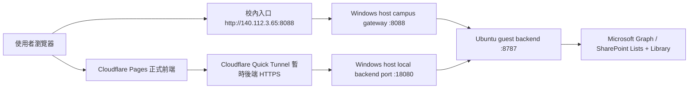

# 專案執行流程

這份文件記錄目前 ISMS 專案的實際執行流、資料流、部署流與已驗證的版本治理方式。目標是讓你切帳號後不必重新摸索。

## 1. 執行拓樸



### 目前入口

- 正式前端：`https://isms-campus-portal.pages.dev/`
- 校內入口：`http://140.112.3.65:8088/`
- 本機後端：`http://127.0.0.1:18080`
- Pages 版本資訊：`https://isms-campus-portal.pages.dev/deploy-manifest.json`

### 重要說明

- 公開 HTTPS 前端固定由 Cloudflare Pages 提供。
- 公開後端目前仍依賴 Quick Tunnel，不是最終形態，但已可穩定支援 UAT 與回歸檢查。
- 校內入口仍由 Windows host gateway 提供，且受校內 IP 限制。

## 2. 前端啟動流

1. `index.html` 載入 SPA bundles。
2. `m365-config.js` 載入基礎設定。
3. `m365-config.override.js` 選擇 live profile 與 endpoint。
4. `app.js` 初始化各模組，先完成登入驗證，再把可延後的資料同步丟到閒置時間。
5. `shell-module.js` 在 authenticated remote bootstrap 完成前不讓主路由過早進入。

### 關鍵前端模組

- `app.js`
  - 協調與啟動
  - profile 切換
  - remote bootstrap
  - 路由繫結
  - 快取與背景同步節奏
- `shell-module.js`
  - 登入殼層
  - 響應式導覽
  - bootstrap gating
- `auth-module.js`
  - 登入 / 登出
  - 重設密碼 / 更改密碼
- `case-module.js`
  - 矯正單流程
- `checklist-module.js`
  - 內稽檢核表流程
- `training-module.js`
  - 教育訓練統計與名單管理
- `unit-contact-application-module.js`
  - 單位管理人申請 / 狀態查詢 / 啟用說明
- `admin-module.js`
  - 帳號管理
  - 資安窗口
  - 操作稽核軌跡
  - 單位治理
  - 系統健康檢查
- `attachment-module.js`
  - 附件顯示與上傳

## 3. 資料來源策略

正式資料來源是 M365 / SharePoint。前端不直接寫 SharePoint，而是透過 backend API。

### Live 模式

- `strictRemoteData: true`
- 核心模組走 backend mode (`m365-api`)
- live backend 使用 `app-only` token 與 Graph mail

### 技術債

- local fallback / local emulator 的程式碼仍存在
- 這些路徑在 live 不應該啟動，但如果 override 漏掉，仍可能造成行為不一致

## 4. Backend 路由

### Guest backend entry

- `m365/campus-backend/server.cjs`

### 主要路由群

- `/api/unit-contact/health`
- `/api/unit-contact/apply`
- `/api/unit-contact/status`
- `/api/unit-contact/applications`
- `/api/unit-contact/review`
- `/api/unit-contact/activate`
- `/api/corrective-actions/*`
- `/api/checklists/*`
- `/api/training/*`
- `/api/system-users/*`
- `/api/auth/*`
- `/api/audit-trail/*`
- `/api/review-scopes/*`
- `/api/attachments/*`

## 5. SharePoint 資料布局

### Lists

- `UnitContactApplications`
- `UnitAdmins`
- `OpsAudit`
- `CorrectiveActions`
- `Checklists`
- `TrainingForms`
- `TrainingRosters`
- `SystemUsers`
- `UnitReviewScopes`

### Library

- `ISMSAttachments`
  - `corrective-actions`
  - `checklists`
  - `training`
  - `misc`

## 6. Guest 部署流

### 目前使用的路徑

- repo: `/srv/isms-form-redesign`
- runtime: `/srv/isms-form-redesign/m365/campus-backend/runtime.local.json`
- frontend override: `/srv/isms-form-redesign/m365-config.override.js`
- service: `isms-unit-contact-backend.service`

### 標準步驟

1. 本地完成修改並 commit。
2. push 到 GitHub。
3. SSH 到 guest。
4. 以 `ismsbackend` 身分 pull repo。
5. 如需，更新 runtime / override。
6. 若 backend 改動，重啟 `isms-unit-contact-backend.service`。
7. 跑 campus live smoke。

### 常見 guest 問題

若 `git pull` 失敗並出現 `gnutls_handshake() failed`，先執行：

```bash
git config --global http.version HTTP/1.1
```

再重試。

## 7. 校內 / Pages 流程

### Windows host gateway

- `8088` 由 Windows host 提供
- 校內 IP 限制在 `host-campus-gateway.cjs`
- 目前校內入口：`http://140.112.3.65:8088/`

### Cloudflare Pages

- Pages 提供固定正式前端入口
- Quick Tunnel 目前負責把 Pages 的 `full-proxy` 連回 backend
- 一旦 backend base 變動，要重新發佈 Pages
- 相關腳本：
  - `scripts/build-cloudflare-pages-package.cjs`
  - `scripts/deploy-cloudflare-pages.ps1`
  - `scripts/ensure-cloudflare-pages-live.ps1`
  - `scripts/refresh-cloudflare-quick-pages-entry.ps1`

## 8. 版本治理

現在版本治理的原則很簡單：以 `deploy-manifest.json` 為準。

### 你要看的欄位

- `versionKey`
- `commit`
- `shortCommit`
- `builtAt`
- `backendBase`
- `mode`

### 比對順序

1. `git rev-parse --short HEAD`
2. 本機 `dist/cloudflare-pages/deploy-manifest.json`
3. 正式站 `https://isms-campus-portal.pages.dev/deploy-manifest.json`
4. 再看畫面內容

### 版本治理的使用原則

- 任何 UI / smoke / Pages 改動，先確認版本資訊是否同步。
- 若正式站內容落後，但 manifest 是最新，優先判斷是否是瀏覽器快取或 Pages 部署尚未更新。
- 若 Pages manifest 落後，優先重新執行 Pages deploy。

## 9. 目前已驗證的功能狀態

### 正常

- 單位管理人申請
- 單位管理人審核 / 啟用
- 資安窗口
- 單位治理
- 內稽檢核表
- 教育訓練
- 矯正單
- 操作稽核軌跡
- 附件顯示 / 上傳
- 版本資訊顯示

### 最近特別整理的頁面

#### 資安窗口

- `#security-window` 現在是依一級單位分組的折疊卡片。
- 頁面上應該看到：
  - `一級單位`
  - `二級單位`
- Pages smoke 目前是用這個結構驗證，不是舊 table 文字。
- 目前 smoke 會等：
  - `.security-window-group-stack .security-window-card`
  - `一級單位`
  - `二級單位`

如果這個頁面再改版，記得同步更新：
- `admin-module.js`
- `styles.css`
- `scripts/security-regression.cjs`
- `scripts/cloudflare-pages-regression-smoke.cjs`

#### 教育訓練名單

- 名單渲染現在有分段輸出與快取。
- 大資料匯入後不要期待一次全 DOM 重算；這是故意拆成背景處理。

#### 內稽檢核表

- 列表頁與搜尋有快取。
- 年份 / 狀態 / 關鍵字切換不再每次重掃整頁。

#### 操作稽核軌跡

- 查詢有短期快取。
- 同條件重開頁面會先顯示舊資料，再背景更新。

## 10. Regression Coverage

### 主回歸套件

- `scripts/live-regression-suite.cjs`

目前包含：

- `campus-live-regression-smoke`
- `live-security-smoke`
- `cloudflare-pages-regression-smoke`
- `version-governance-smoke`
- `campus-browser-regression-smoke`
- `unit-contact-public-visual-smoke`
- `campus-unit-contact-public-visual-smoke`
- `unit-contact-admin-review-smoke`
- `unit-contact-account-to-fill-smoke`

### 額外專項

- `scripts/security-regression.cjs`
- `scripts/stress-regression.cjs`
- `scripts/role-flow-probe.cjs`
- `scripts/audit-followup-smoke.cjs`
- `scripts/training-roster-focus-smoke.cjs`
- `scripts/training-roster-batch-delete-smoke.cjs`

## 11. 已知阻塞與處理原則

### 1. `AUTH_SESSION_SECRET` 缺失

處理：先補環境變數，再啟動 backend。

### 2. `./runtime/runtime.local.host.json` 編碼錯誤

處理：改成 UTF-8 無 BOM。

### 3. `8088` 不通

處理：先看 `18080`，再重啟 host gateway。

### 4. Pages 內容看起來過期

處理：
1. 檢查 `deploy-manifest.json`
2. 確認是否真的重發 Pages
3. 無痕或 `Ctrl + F5`

### 5. `gnutls_handshake() failed`

處理：

```bash
git config --global http.version HTTP/1.1
```

### 6. `401` / `session` 競態

處理：單獨重跑該支 smoke，不要把平行競態當成產品錯誤。

### 7. `security-window` 舊版畫面

處理：
1. 確認 `admin-module.js`、`styles.css` 已發佈
2. 確認 Pages manifest 已更新
3. 重新跑 `scripts/security-regression.cjs`

## 12. 切帳號時的最短路徑

1. 先看這份文件。
2. 先看 `git status --short`。
3. 確認 `AUTH_SESSION_SECRET`。
4. 起 `service-host.cjs`。
5. 起 `8088` gateway。
6. 確認 `deploy-manifest.json`。
7. 跑基本 smoke。
8. 若有 UI 改動，再跑對應專項 smoke。

## 13. 下一次最先要看的檔案

- `docs/fast-redeploy-runbook.md`
- `docs/project-execution-flow.md`

## ????????

???????????? [`docs/data-layer-governance.md`](data-layer-governance.md)?

- ????????
- ???????
- ????
- ??????
- ????? release gate

????????????????? deploy-manifest ????????????

## 啟動契約補充
- 本機與 guest 的 backend 啟動流程已統一由 `service-host.cjs` 接手。
- runtime config 若有 BOM，service-host 會自動清除。
- 預設搜尋順序：
  1. 明確傳入的 runtime config
  2. `UNIT_CONTACT_BACKEND_RUNTIME_CONFIG`
  3. `.runtime/runtime.local.host.json`
  4. `m365/campus-backend/runtime.local.json`
- 版本治理仍以 `deploy-manifest.json` + `version-governance-smoke` 作為 release gate。
