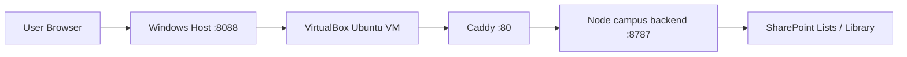

# Project Execution Flow

This document records the actual runtime flow of the ISMS project as it is implemented today, including browser modules, M365 backend routes, guest deployment, and live campus entry.

## 1. Runtime Topology



## 2. Frontend Flow

### Boot sequence

1. `index.html` loads the SPA bundles.
2. `m365-config.js` loads base profile settings.
3. `m365-config.override.js` overrides live endpoints and mode flags.
4. `app.js` initializes modules and performs startup sync:
   - users
   - training forms
   - training rosters
   - checklists
   - corrective actions

### Main frontend modules

- `app.js`
  - orchestration
  - repository switching
  - startup sync
- `auth-module.js`
  - login
  - reset password
  - session handling
- `case-module.js`
  - corrective action workflow
- `checklist-module.js`
  - internal audit checklist workflow
- `training-module.js`
  - training statistics workflow
- `admin-module.js`
  - account management
- `attachment-module.js`
  - local attachment storage
  - remote-attachment rendering support

## 3. Data Source Strategy

The project currently uses a mixed strategy with M365 as the target system of record.

### Already backendized

- unit contact
- corrective actions
- checklists
- training
- system users
- auth

### Attachment status

- attachment backend router exists
- frontend backend-mode support exists
- live is still kept in local attachment mode until `ISMSAttachments` is provisioned

## 4. Backend Routes

### Guest backend entry

- `m365/campus-backend/server.cjs`

### Current route groups

- `/api/unit-contact/*`
- `/api/corrective-actions/*`
- `/api/checklists/*`
- `/api/training/*`
- `/api/system-users/*`
- `/api/auth/*`
- `/api/attachments/*`

## 5. SharePoint Data Layout

### Lists

- `UnitContactApplications`
- `UnitAdmins`
- `OpsAudit`
- `CorrectiveActions`
- `Checklists`
- `TrainingForms`
- `TrainingRosters`
- `SystemUsers`

### Library

- `ISMSAttachments`
  - `corrective-actions`
  - `checklists`
  - `training`
  - `misc`

## 6. Guest Deployment Flow

### Repo and service paths

- repo: `/srv/isms-form-redesign`
- runtime: `/srv/isms-form-redesign/m365/campus-backend/runtime.local.json`
- frontend override: `/srv/isms-form-redesign/m365-config.override.js`
- service: `isms-unit-contact-backend.service`

### Standard deployment steps

1. Commit local changes.
2. Push to GitHub.
3. SSH to guest.
4. Pull repo under `ismsbackend`.
5. Update runtime/override if needed.
6. Restart `isms-unit-contact-backend.service`.
7. Run live smoke.

### Known guest issue

If guest Git fails with `gnutls_handshake() failed`, set:

```bash
git config --global http.version HTTP/1.1
```

and retry the pull.

## 7. Campus Entry Flow

### Host gateway

- Windows host exposes `8088`
- campus IP restriction is enforced on the host gateway
- current campus test entry:
  - `http://140.112.3.65:8088/`

### Live smoke script

- `scripts/campus-live-regression-smoke.cjs`

It verifies:

- homepage
- runtime override
- health of core modules
- system-users count
- auth success / failure behavior

## 8. Provisioning Flow

### Preferred

Run backend provision scripts first:

- corrective actions
- checklists
- training
- attachments

### Fallback

If Graph create operations return `403 accessDenied`, use browser-session provisioning:

- lists:
  - `scripts/sharepoint-browser-provision.js`
- attachment library:
  - `scripts/sharepoint-browser-attachment-provision.js`

## 9. Migration Flow

### Browser-local to M365

- script:
  - `scripts/browser-m365-live-migration.js`

### Important rule

Migration only works when run in the browser profile that actually contains the old local data. If all totals are `0`, that browser profile is not the real source.

## 10. Current Operational State

### Ready

- unit contact
- corrective actions
- checklists
- training
- system users
- auth
- live deployment and smoke verification

### Not yet fully ready

- attachments live mode

Reason:

- `ISMSAttachments` still requires successful SharePoint provisioning before live can switch to backend attachment mode.
