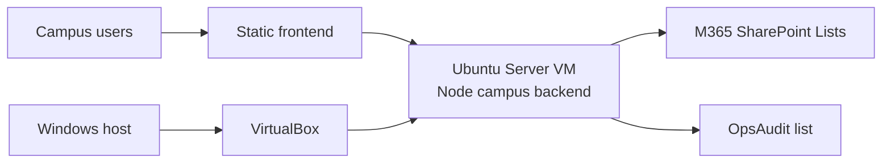

# Windows + VirtualBox + Ubuntu Server VM Deployment

- Updated: 2026-03-12
- Recommended when:
  - you have one dedicated Windows host
  - you want better isolation than running the API directly on the host
  - you are not ready to move to NTU VM or Azure yet

## Why This Path Is Reasonable

This path keeps the current campus backend architecture:

1. campus frontend stays static
2. SharePoint Lists stay in M365
3. the campus backend runs in one Ubuntu Server VM
4. the Windows host only acts as the VM host

This is a good stepping stone because the Ubuntu guest can later be moved to:

- NTU VM
- another on-prem host
- a cloud VM

without redesigning the backend.

## Recommended Software

- Host OS:
  - Windows 11 Pro or another Windows edition that can run VirtualBox reliably
- Virtualization:
  - Oracle VirtualBox
- Guest OS:
  - Ubuntu Server 24.04 LTS
- Reverse proxy:
  - Caddy
- Runtime:
  - Node.js LTS

## Architecture

## Recommended VM Sizing

Start with:

- 2 vCPU
- 4 GB RAM
- 40 GB disk

If this host will run only this backend, this is usually enough for the current workload.

## VirtualBox Host Guidance

- Use a dedicated host if possible
- Keep the host awake and disable sleep
- Reserve enough RAM for the Ubuntu VM
- Keep one snapshot only for rollback before major changes
- Prefer bridged networking if the VM must be reachable from other campus devices

## Ubuntu Guest Guidance

Install these baseline packages:

- `openssh-server`
- `git`
- `curl`
- `nodejs`
- `npm`
- `caddy`

Store the repo on a stable path such as:

- `/srv/isms-form-redesign`

Run the backend as a Linux service with:

- [C:\Users\MOECISH\Desktop\ai-isms\ISMS-Form-Redesign\m365\campus-backend\ubuntu\systemd\isms-unit-contact-backend.service](C:\Users\MOECISH\Desktop\ai-isms\ISMS-Form-Redesign\m365\campus-backend\ubuntu\systemd\isms-unit-contact-backend.service)

Reverse proxy and TLS can be handled by:

- [C:\Users\MOECISH\Desktop\ai-isms\ISMS-Form-Redesign\m365\campus-backend\ubuntu\Caddyfile.sample](C:\Users\MOECISH\Desktop\ai-isms\ISMS-Form-Redesign\m365\campus-backend\ubuntu\Caddyfile.sample)

## Network Recommendation

Choose one:

1. NAT
   - easiest for local-only testing
   - harder if campus users must reach the VM directly
2. Bridged Adapter
   - recommended when this VM should behave like a normal campus host
   - easier for internal DNS or fixed IP

Inference:
Bridged mode is usually the better production-like choice for a campus-hosted internal API.

## M365 Account Rule

Inside the Ubuntu VM, sign in with CLI for Microsoft 365 using the same M365 account that already has:

- SharePoint site-owner access
- list read/write validation

Do not rely on the Windows host login to carry into the Ubuntu guest. Treat the VM as a separate machine.

## Suggested Build Order

1. Install VirtualBox on the Windows host
2. Create Ubuntu Server VM
3. Install Ubuntu Server
4. Give the VM a stable IP or DNS name
5. Install Node.js and Caddy in Ubuntu
6. Clone this repo into `/srv/isms-form-redesign`
7. Create `runtime.local.json` from the Ubuntu sample
8. Run one direct backend health check
9. Sign in with CLI for Microsoft 365 inside the VM
10. Enable the systemd service
11. Put Caddy in front of the backend
12. Point the frontend override to the VM hostname

## Files To Use

- VM checklist:
  [C:\Users\MOECISH\Desktop\ai-isms\ISMS-Form-Redesign\docs\virtualbox-ubuntu-vm-checklist.md](C:\Users\MOECISH\Desktop\ai-isms\ISMS-Form-Redesign\docs\virtualbox-ubuntu-vm-checklist.md)
- One-hour build order:
  [C:\Users\MOECISH\Desktop\ai-isms\ISMS-Form-Redesign\docs\virtualbox-ubuntu-vm-one-hour-plan.md](C:\Users\MOECISH\Desktop\ai-isms\ISMS-Form-Redesign\docs\virtualbox-ubuntu-vm-one-hour-plan.md)
- Ubuntu runtime sample:
  [C:\Users\MOECISH\Desktop\ai-isms\ISMS-Form-Redesign\m365\campus-backend\ubuntu\runtime.ubuntu.sample.json](C:\Users\MOECISH\Desktop\ai-isms\ISMS-Form-Redesign\m365\campus-backend\ubuntu\runtime.ubuntu.sample.json)
- systemd unit:
  [C:\Users\MOECISH\Desktop\ai-isms\ISMS-Form-Redesign\m365\campus-backend\ubuntu\systemd\isms-unit-contact-backend.service](C:\Users\MOECISH\Desktop\ai-isms\ISMS-Form-Redesign\m365\campus-backend\ubuntu\systemd\isms-unit-contact-backend.service)
- Caddy sample:
  [C:\Users\MOECISH\Desktop\ai-isms\ISMS-Form-Redesign\m365\campus-backend\ubuntu\Caddyfile.sample](C:\Users\MOECISH\Desktop\ai-isms\ISMS-Form-Redesign\m365\campus-backend\ubuntu\Caddyfile.sample)

## Migration Later

If you later get an NTU VM, reuse:

- the repo
- the runtime config structure
- the systemd service
- the Caddy reverse proxy pattern

This is why this path is worth doing now.
